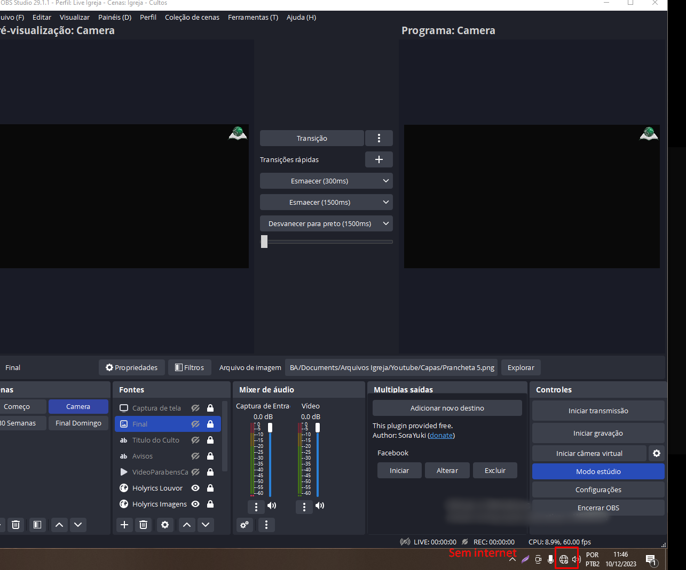
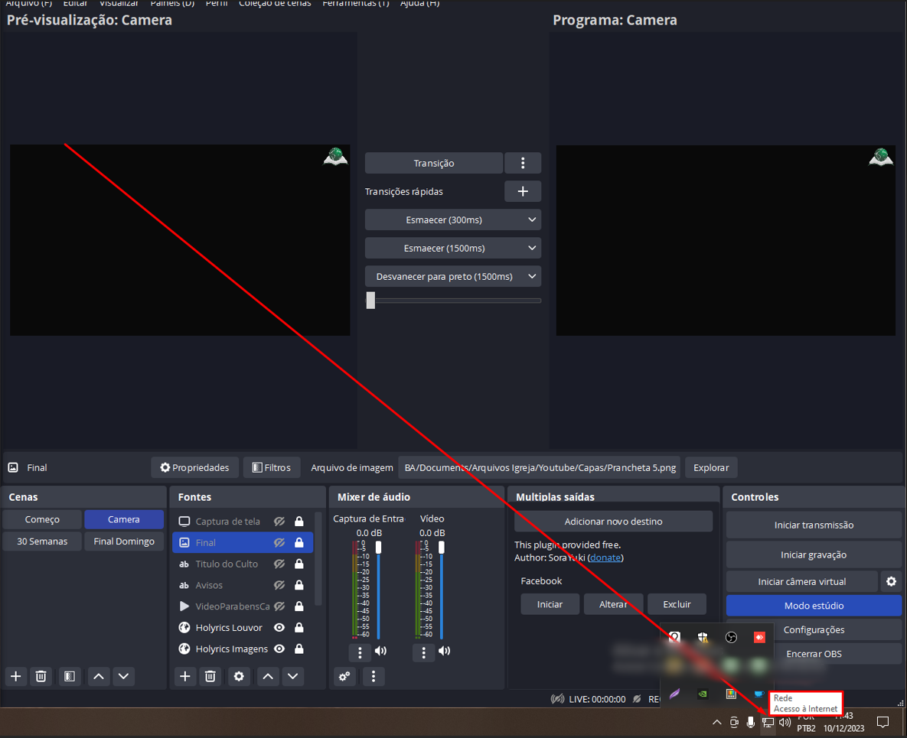
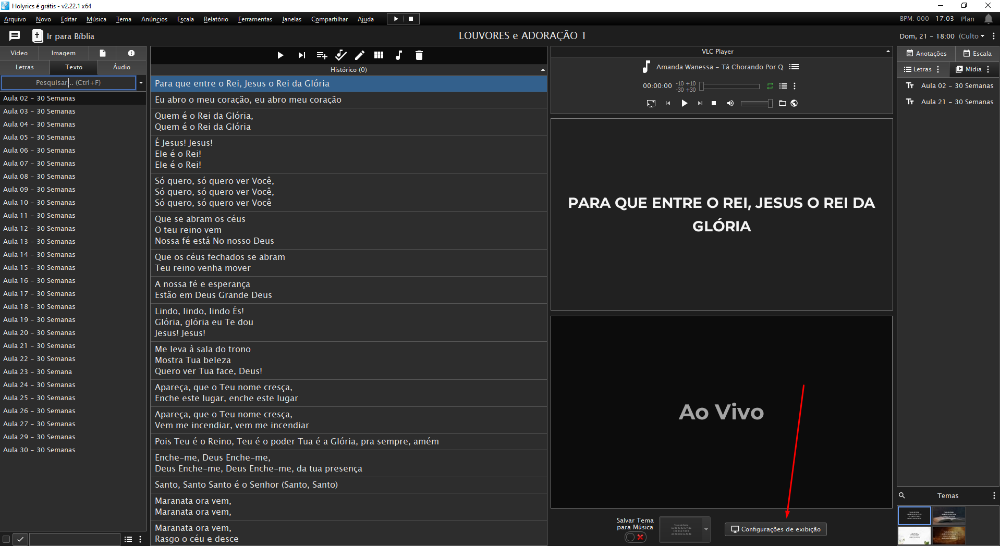
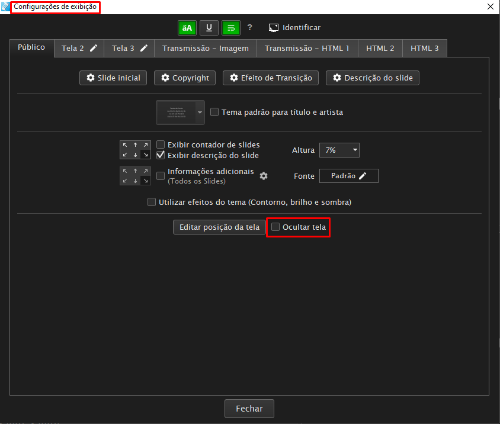
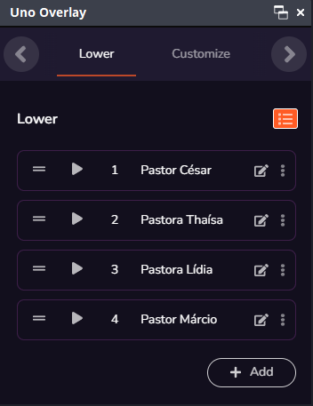
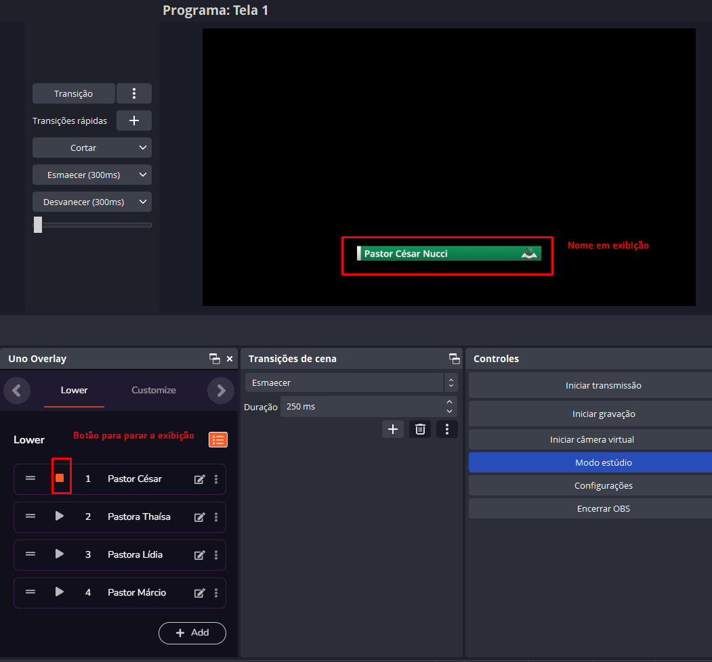
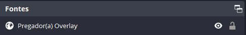

<<<<<<< HEAD
# Configuração Inicial

## Projeção x Transmissão

    Projeção é tudo o que fazemos internamente, por exemplo:
        Ao iniciar o OBS projetamos a tela de programa para a igreja.
---
     Transmissão é tudo o que enviamos para outro lugar, por exemplo: 
        Ao iniciarmos a transmissão, estamos enviando nosso vídeo em tempo real para o Youtube.

## Como verificar conexão a com a internet

Para verificar a conexão com a internet, cheque o ícone próximo ao relógio:

> IMPORTANTE: Caso estejamos sem internet e seja um dos cultos que ficam como públicos (quarta e domingo à noite) ao invés de transmitir, utilizar a gravação do OBS. Qualquer outro culto, utilizar apenas projeção.

### Sem internet

### Com internet

---

## 30 semanas

Para a projeção nos dias do 30 semanas, é necessário alterar a forma de exibição do holyrics. Para fazer isso, você precisa estar na tela inicial do holyrics, e clicar em configurações de exibição:

E desmarcar a opção ocultar tela:

Ao término do 30 semanas, voltar a configuração para ocultar tela e testar antes de desligar o computador.

## Uno Overlay

O Uno Overlay é um painel utilizado para exibir os nomes dos pregadores(as) nos cultos:

Para utilizá-lo basta apenas clicar no botão play no nome do pregador(a) e deixar rodar por 30 segundos.

Após 30 segundos, clicar no botão Stop.

O nome do pregador aparecerá apenas quando a Fonte estiver visível:

## Ligar Projetor

## Ligar TV

## Ligar câmera
=======
# Antes de iniciar

> Primeiros passos antes de ligar o computador.
>>>>>>> 3ec98ac09918f8782589cbb3c611e2c434f96d62
