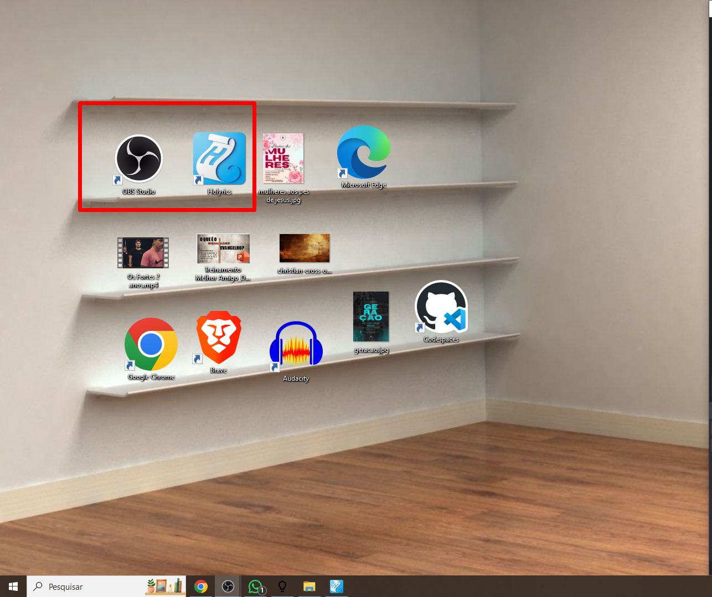
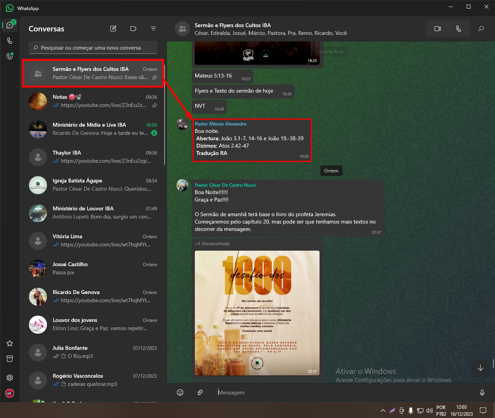
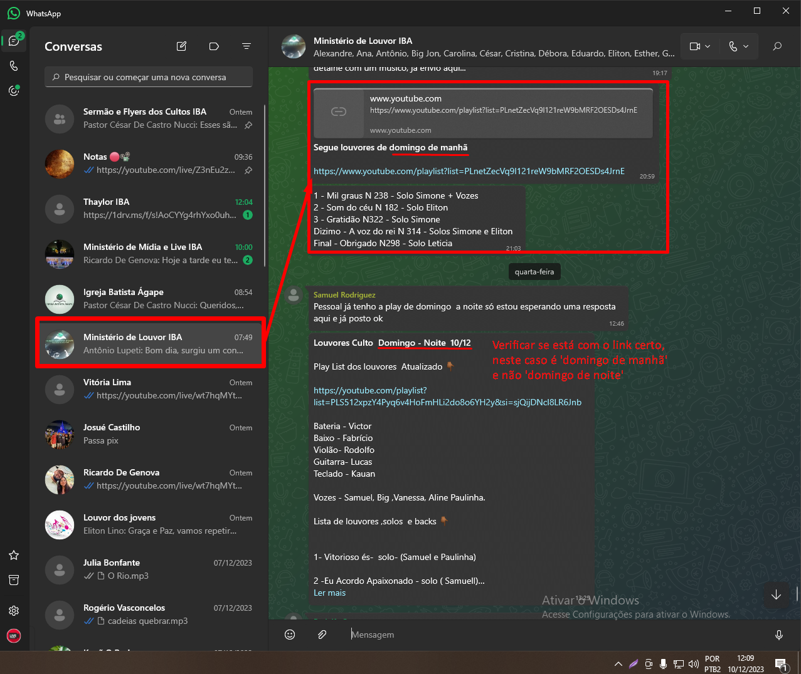
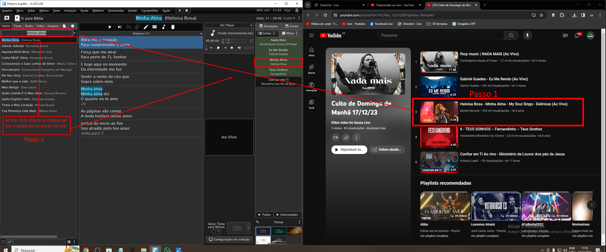
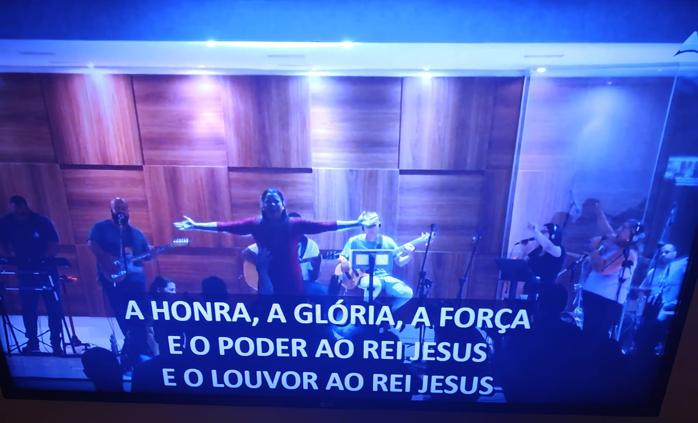
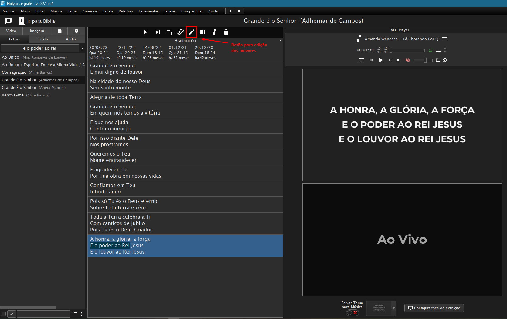
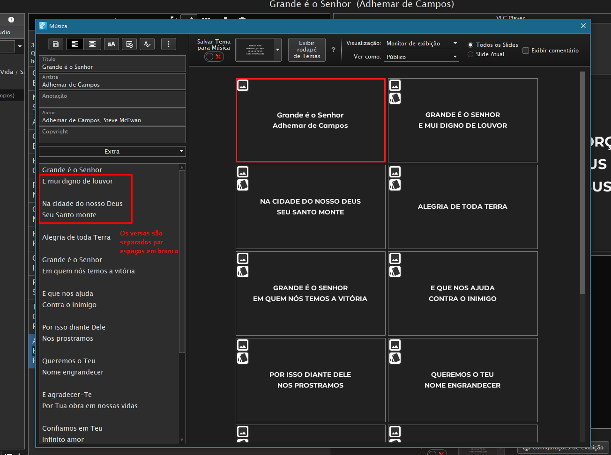
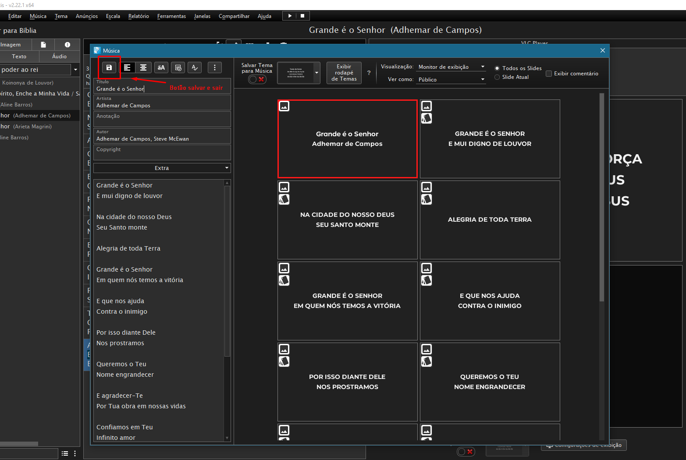

# Projeção x Transmissão :id=projecao-transmissao

?>Projeção é tudo o que fazemos internamente, por exemplo:
Ao iniciar o OBS projetamos a tela de programa para a igreja.

---

?>Transmissão é tudo o que enviamos para outro lugar, por exemplo:
Ao iniciarmos a transmissão, estamos enviando nosso vídeo em tempo real para o Youtube.

# Projeção Interna / 30 semanas

Para a projeção interna, e nos dias do 30 semanas é necessário alterar a forma de exibição do holyrics. Para fazer isso, você precisa estar na tela inicial do holyrics, e clicar em configurações de exibição:

E desmarcar a opção ocultar tela:

Ao término do 30 semanas, voltar a configuração para ocultar tela e testar antes de desligar o computador.

# 1. Configuração Inicial

?> Os passos 1.1 até o 1.3 são feitos antes de ligar o computador.

## 1.4. Como verificar conexão a com a internet

Para verificar a conexão com a internet, cheque o ícone próximo ao relógio:

!> IMPORTANTE: Caso estejamos sem internet e seja um dos cultos que ficam como públicos (quarta e domingo à noite) ao invés de transmitir, utilizar a gravação do OBS. Qualquer outro culto, utilizar apenas projeção.

### 1.4.1. Sem internet

### 1.4.2. Com internet

## 1.5 e 1.6 Abrir Holyrics e abrir OBS

O Holyrics e OBS são abertos ao clicar 2x em seus ícones.

!> IMPORTANTE: Abrir _SEMPRE_ o Holyrics primeiro, pois o OBS depende dele já estar aberto para exibição de músicas, imagens e a Bíblia.

---

# 2. Preparar o Holyrics

## 2.1. Pegar versículos

Os Versículos que serão utilizados nos cultos normalmente são enviados em até 1 dia de antecedência, no grupo 'Sermão e Flyers' no whatsapp:

## 2.2. Pegar louvores para o culto atual

Os louvores que serão ministrados nos cultos normalmente são enviados em até 1 dia de antecedência, no grupo do Ministério de Louvor e da Igreja...

No formato de playlist do youtube:

## 2.3. Deixar louvores com 2 linhas

!> IMPORTANTE: Os louvores precisam estar em 2 linhas ou menos pois caso eles possuam muitas palavras a imagem na transmissão fica ruim. 

### 2.3.1. Editar louvores

Com a música que precisa ser editada aberta, clicar no botão editar:

Separar os versos em grupos de 2 linhas:

Salvar e sair ao terminar:

# 6. Abertura

## 6.1. Como exibir o Nome do pregador(a)

O Uno Overlay é um painel utilizado para exibir os nomes dos pregadores(as) nos cultos:

Para utilizá-lo basta apenas clicar no botão play no nome do pregador(a) e deixar rodar por 30 segundos.

Após 30 segundos, clicar no botão Stop.

O nome do pregador aparecerá apenas quando a Fonte estiver visível:

## 6.2. Verificar qualidade da transmissão

Para verificar a qualidade da transmissão, é necessário olhar na página da transmissão do youtube, e nas informações da transmissão no OBS.

!>IMPORTANTE: Caso a transmissão esteja muito ruim ao iniciar o culto, iniciar a gravação em arquivo no PC.Em último caso esse vídeo pode ser enviado para o youtube posteriormente.

